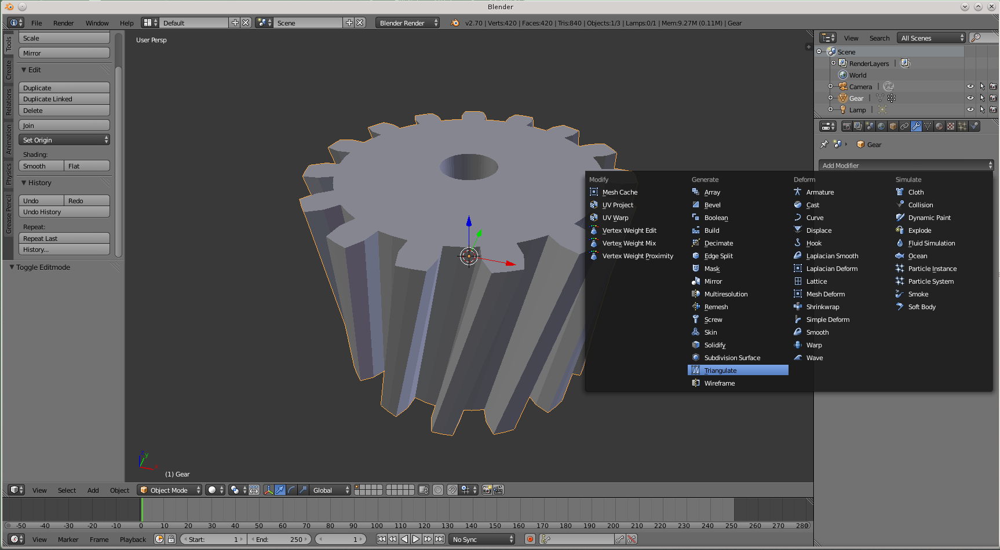

Blender is a free and open-source 3D creation suite that supports the entire production pipeline — modeling, sculpting, animation, rigging, simulation, rendering, compositing, motion tracking, video editing, and game asset creation.

Ideal for 3D artists, animators, designers, game developers, VFX artists, and content creators who need a powerful all-in-one 3D tool with zero licensing cost.

Key Features
------------

- Full 3D modeling and sculpting toolset.
- Advanced animation and rigging system.
- Industry-grade rendering engines (Cycles and Eevee).
- Physics simulations (smoke, fire, fluids, cloth, particles).
- Compositing and motion tracking tools.
- Video Sequence Editor for basic video editing.
- Grease Pencil for 2D animation in 3D space.
- UV unwrapping and texture painting.
- Python scripting and add-on support.
- Cross-platform support (Windows, macOS, Linux).

Quick Start
-----------

1. Download the latest release archive.  
2. Extract the archive to a folder  ofyour choice.  
3. Install and launch Blender.

License
-------

This project is licensed under the MIT License.
